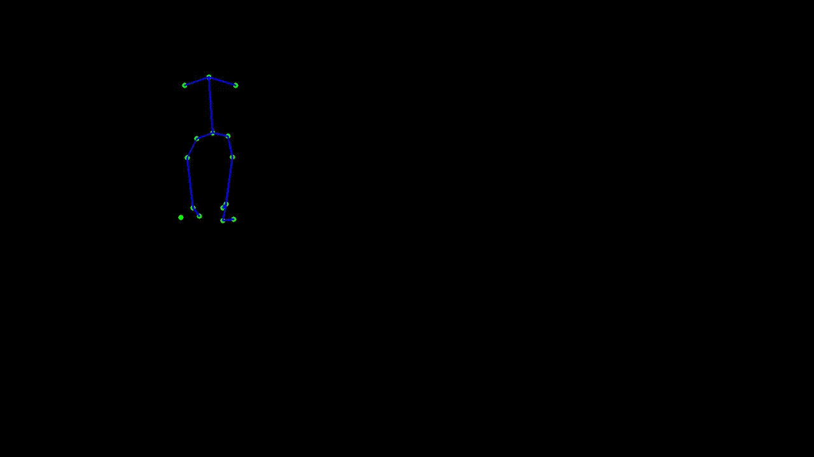
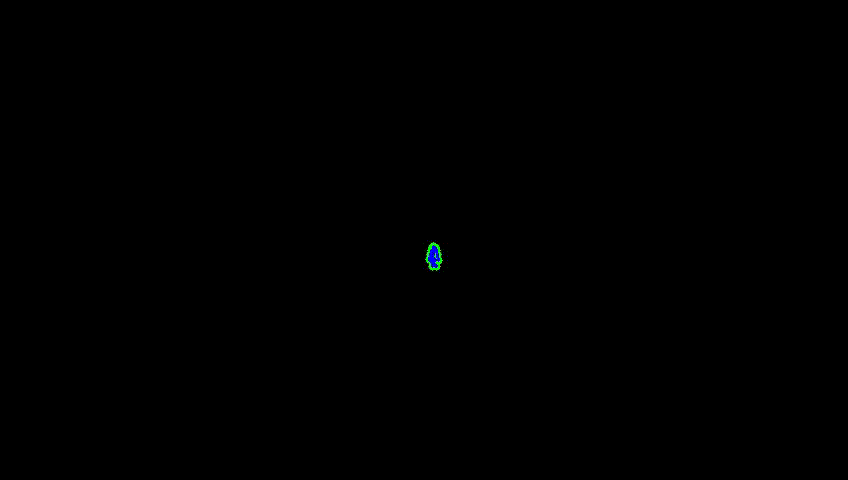
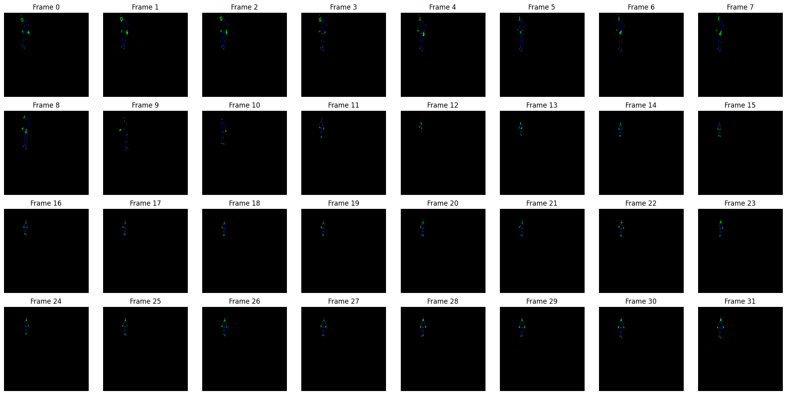
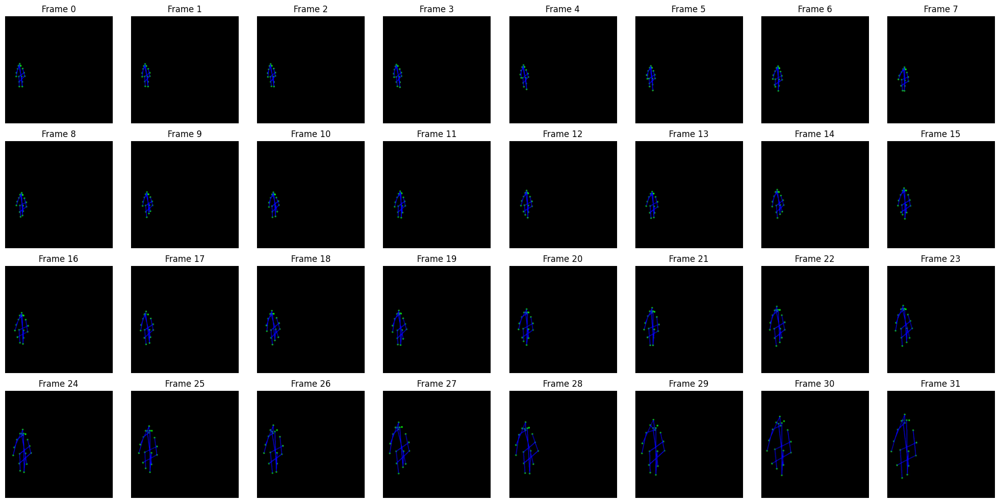

# 🎓 Gait-ViViT: A Video Processing Model for Parkinson's Disease Detection

---

## 🔬 About this Repository

This repository contains the project I have developed for my internal internship at VisionLab in Sapienza University of Rome, under the supervision of **Professor Marini** and **Dr. Diko**, as part of my Bachelor's Thesis in *Applied Computer Science and Artificial Intelligence*.

The project focuses on **adapting existing video processing models and techniques** to the task of detecting Parkinson's disease based on a subject's gait.

---

## 📂 Project Structure

```text
.
├── dataframes/
│   ├── tensor_dataset.csv
│   └── unified_dataset.csv
├── media/
│   ├── internal_frames.png
│   ├── kaggle_frames.png
│   ├── internal_sample.gif
│   └── kaggle_sample.gif
├── notebooks/
│   ├── 01_dataset_setup.ipynb
│   ├── 02_frame_extraction.ipynb
│   ├── 03_model_implementation.ipynb
│   ├── 04_training.ipynb
│   ├── 05_training_cascaded.ipynb
│   ├── 06_training_few_shot.ipynb
│   └── 07_performance_analysis.ipynb
├── presentation/
│   ├── report.pdf
│   └── slides.pdf
├── results/
│   ├── few_shot/
│   │   ├── ablation_study_few_shot.png
│   │   ├── training_performance_few_shot.png
│   │   └── validation_performance_few_shot.png
│   ├── v1/
│   │   ├── ablation_study_1.png
│   │   ├── training_performance_1.png
│   │   └── validation_performance_1.png
│   ├── v2/
│   │   ├── ablation_study_2.png
│   │   ├── training_performance_2.png
│   │   └── validation_performance_2.png
│   ├── v3/
│   │   ├── ablation_study_3.png
│   │   ├── training_performance_3.png
│   │   └── validation_performance_3.png
│   ├── v4/
│   │   ├── ablation_study_4.png
│   │   ├── training_performance_4.png
│   │   └── validation_performance_4.png
│   ├── v5/
│   │   ├── ablation_study_5.png
│   │   ├── training_performance_5.png
│   │   └── validation_performance_5.png
│   └── v6/
│       ├── ablation_study_6.png
│       ├── training_performance_6.png
│       └── validation_performance_6.png
├── gait_vivit_complete.ipynb
└── requirements.txt
```

---

## 📊 Datasets

- [Connie et al.'s Kaggle MMU Visual-Based Parkinson's Disease Dataset (https://www.kaggle.com/datasets/teeconnie/mmu-visual-based-parkinsons-disease-dataset)
-  An internal dataset from Sapienza University of Rome, *DOI coming soon*.

---

## ⚙ Project Pipeline

The complete pipeline can be found at `gait_vivit_complete.ipynb`.

> [!TIP]
> Due to the intensive nature of this project, it is recommended to open the notebooks on Google Colab.

> [!NOTE]
> The notebooks in this repository feature absolute paths for **Google Drive**, such as `/content/drive/MyDrive/...`, which should be **changed** in order to reproduce them on your environment.

---

### 🛠 Data Acquisition and Preprocessing

Since the datasets contain different file formats, each file is **rendered into a synthetic .mp4 video** containing just a black background and a skeleton extracted using [AlphaPose's Halpe Full-Body Human Keypoints](https://github.com/Fang-Haoshu/Halpe-FullBody) pose estimation model.

Kaggle|Internal
--|--
|

Information about each video, such as source and path, and a label indicating whether the subject is healthy or afflicted with Parkinson's disease are then stored in the `unified_dataset.csv` dataframe.

---

### 🎥 Frame Extraction

After rendering each video, the frame extraction pipeline presented in `02_frame_extraction.ipynb` is performed.

After **discarding non-existing or noisy pixels**, this pipeline uniformly samples **32 frames from each video**, which are **smoothed using a median filter** and **resized to `(224, 224)`**.

The function ultimately returns an array of shape `(32, 224, 224, 3)`.

Kaggle|Internal
--|--
|

When performing frame extraction on the videos in the `unified_dataset.csv` file, the extracted frames are converted into a tensor and, together with the label associaed to the original video, are stored in the `tensor_dataset.csv` file.

> [!NOTE]
> This new dataframe includes only those videos for which the frame extraction procedure was successful.

> [!NOTE]
> The `patient_id` attribute in this dataframe is added in a second moment to avoid data leakage during training.

To simplify data retrieval during training, a custom `GaitViViTDataset` class is created.
1) The `__init__()` function initializes the instance of the class.
2) The `__len__()` function returns the number of items in the dataset.
3) The `__getitem__()` function loads a chosen tensor and, after reshaping and transforming it, returns the (transformed) normalized tensor and the label of the original video.

---

### 🧠 Model Implementation

The chosen backbone is based on the `VivitForVideoClassification` class provided by [Hugging Face](https://huggingface.co/docs/transformers/v5.14.0/en/model_doc/vivit#transformers.VivitForVideoClassification).

The first step is to **extract non-overlapping spatio-temporal tubelets** from the input tensors.

After prepending the `[CLS]` token and adding the positional embeddings, the patch sequence passes through the **encoder block**, which consists of **12 layers**.

Each layer alternates between an **attention block**, which uses the **scaled dot-product attention** mechanism described in [*Video Vision Transformer* (Model 1)](https://arxiv.org/abs/2103.15691), and a **multilayer perceptron**, which is implemented on the basis of the **original backbone** but using the **Fast GELU approximation**.

The classification head is adjusted for the task by featuring a linear layer, which upscales the extracted features to a higher-dimensional space, followed by a ReLU activation before projecting the extracted features onto a **one-dimensional logit**.

The model is initialized using the **pre-trained weights**, which are loaded through a mapping function, except for the classification head, which will be trained from scratch.

[!NOTE]
> The mapping shows some discrepancies between the original backbone and the `GaitViViT` implementation, likely due to floating-point inaccuracies.

---

### 👾 Training

Due to the nature of the task, the model is trained using a three-step pipeline:
1) **Linear Probing**: The backbone is frozen and the head is trained for 5 epochs using a higher learning rate.
2) **Finetuning**: The entire model is finetuned using grid search, which tests different combinations of starting learning rate and weight decay, for 15 epochs, introducing early stopping to avoid overfitting.
3) **Testing**: The best model is tested on unseen data to assess its learning performance.

Concerning the training loop per se, the model is optimized using **stochastic gradient descent with momentum** with a **cosine learning rate scheduler**.

Due to the class imbalance of the dataset, the chosen loss function is `nn.BCEWithLogitsLoss()`, which combines a sigmoid layer with binary cross entropy loss.

The dataset split is performed using the `StratifiedGroupKFold` function, which combines **K-fold cross-validation** with **stratified sampling** to ensure that class distributions are (approximately) preserved while preventing data contamination.

| Component | Proportion |
| :---: | :---: |
| Training Set | 70% |
| Validation Set | 10% |
| Testing Set | 20% |

---

### 🎯 Performance Analysis and Evaluation

For a more robust analysis, six versions of the model, which differ by **upscaling factor** and/or **activation function**, are trained on the dataset, using **all 5 folds** generated in the data split.

| Version | Upscaling Factor | Activation Function |
| :---: | :---: | :---: |
| 1 | $2.0$ | ReLU |
| 2 | $1.0$ | ReLU |
| 3 | $4.0$ | ReLU |
| 4 | $2.0$ | GELU |
| 5 | $1.0$ | GELU |
| 6 | $4.0$ | GELU |

The **linear probing phase** uses a starting learning rate of $\eta_{start} = 3 \cdot 10^{-4}$ that is adjusted using cosine scheduling with warmup.

The **fine-tuning phase** uses various combinations of starting learning rate and weight decay and sets an early stopping counter of 5 epochs before interrupting.

| Hyperparameter | Values |
| :---: | :---: |
| Starting Learning Rate ($\eta_{start}$) | $\{10^{-6}, 10^{-5}, 10^{-4}\}$ |
| Weight Decay ($\lambda$) | $\{10^{-2}, 10^{-1}\}$ |

Running the model on each fold reveals that the **dataset is too small** to train a data-hungry transformer-based model, resulting in **less consistent performance**.

| Version | Upscaling Factor | Activation Function | Testing F1 ($\mu \pm \sigma$) |
| :---: | :---: | :---: | :---: |
| 1 | $2.0$ | ReLU | $0.630 \pm 0.155$ |
| 2 | $1.0$ | ReLU | $0.644 \pm 0.151$ |
| 3 | $4.0$ | ReLU | $0.654 \pm 0.154$ |
| 4 | $2.0$ | GELU | $0.661 \pm 0.166$ |
| 5 | $1.0$ | GELU | $0.660 \pm 0.147$ |
| 6 | $4.0$ | GELU | $0.664 \pm 0.160$ |

To better investigate this issue, the same dataset was used to train two different architectures for the same task.
1. A **cascaded CNN-LSTM model** using the same classification head as the `GaitViViT` model.
This model achieves similar results to the transformer architecture, but with a higher loss, suggesting that it performs even worse: this result can be explained by the fact that these models tend to struggle on imbalanced datasets.
2. A **few-shot action detection model** that combines the `GaitViViT` backbone with temporal cross-attention transformers.
Using episodic learning, this model is able to achieve consistently high performance, suggesting that a few-shot architecture might be more suitable than the transformer-based architecture for this task.

More detailed information about each version's performance is also presented in the `results/` folder.

---
